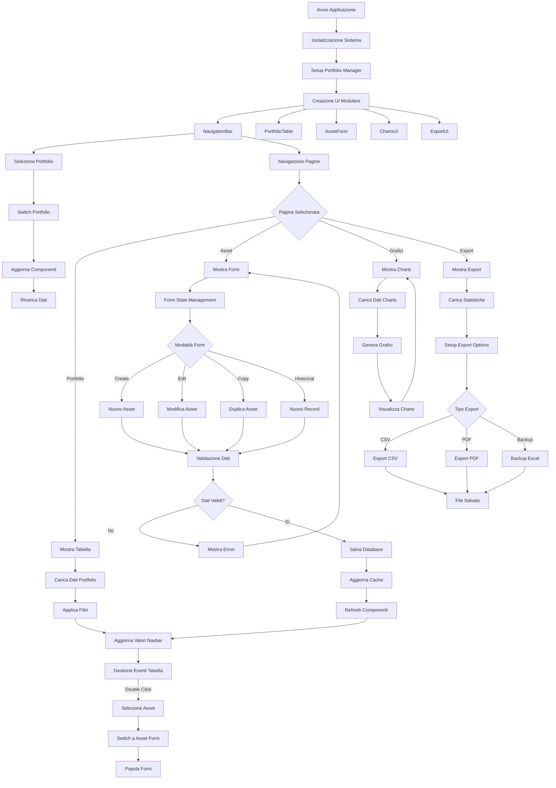
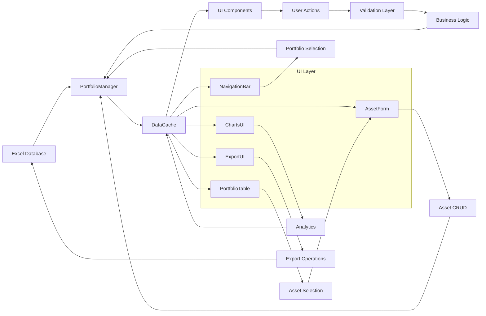

# GAB AssetMind - Architettura e Diagramma di Flusso

## 🏗️ Architettura Modulare (Versione 2.0)

L'applicazione è stata completamente refactorizzata con un'architettura modulare che separa le responsabilità e migliora la manutenibilità.

### 📁 Struttura dei File

```
GAB_AssetMind/
├── main.py                   # Applicazione principale (refactored)
├── config.py               # Configurazione centralizzata
├── utils.py                # Utilità e helper functions
├── models.py               # Logica business e database
├── ui_components.py        # Componenti UI base (NavigationBar, PortfolioTable)
├── asset_form.py           # Componente form gestione asset
├── charts_ui.py            # Componente grafici e analytics
├── export_ui.py            # Componente esportazione dati
├── export_utils.py         # Utilità export PDF/CSV
├── GAB_AssetMind.pyw       # Avvio Windows senza console (refactored)
├── _Legacy/main.py         # Versione originale (legacy)
└── portfolio_data.xlsx     # Database Excel
```

## 🔧 Componenti dell'Architettura

### 1. **Configuration Layer** (`config.py`)
Configurazione centralizzata per tutta l'applicazione:
- **UIConfig**: Colori, dimensioni, font standardizzati
- **FieldMapping**: Mappatura campi database ↔ UI
- **AssetConfig**: Configurazione categorie e validazione asset
- **DatabaseConfig**: Configurazione database e file
- **ValidationConfig**: Regole di validazione dati
- **Messages**: Messaggi standardizzati

### 2. **Utils Layer** (`utils.py`)
Funzioni di utilità riutilizzabili:
- **DataValidator**: Validazione e pulizia dati
- **DateFormatter**: Formattazione date multiple formati
- **CurrencyFormatter**: Gestione formattazione valuta
- **ErrorHandler**: Gestione centralizzata errori
- **DataCache**: Cache dati per performance
- **FieldUtils**: Utilità gestione campi

### 3. **Models Layer** (`models.py`)
Logica di business e persistenza:
- **Asset**: Modello dati asset
- **PortfolioManager**: CRUD operations e business logic
- Gestione Excel con formule
- Calcoli portfolio e summary

### 4. **UI Components Layer**
Componenti UI specializzati e riutilizzabili:

#### **BaseUIComponent** (`ui_components.py`)
Classe base per tutti i componenti UI con sistema di callback

#### **NavigationBar** (`ui_components.py`)
- Gestione navigazione globale
- Visualizzazione valori portfolio
- Selezione e creazione portfolio
- Bottoni navigazione pagine

#### **PortfolioTable** (`ui_components.py`)
- Tabella dati con filtri avanzati
- Toggle Record/Asset view
- Zoom dinamico e scrollbar
- Gestione selezione e eventi

#### **AssetForm** (`asset_form.py`)
- Form dinamico gestione asset
- State management (create/edit/copy/historical)
- Validazione dati avanzata
- Campi dinamici per categoria

#### **ChartsUI** (`charts_ui.py`)
- Grafici interattivi matplotlib
- Multiple visualizzazioni (torta, barre, temporale)
- Calcoli coerenti con portfolio
- Gestione errori visualizzazione

#### **ExportUI** (`export_ui.py`)
- Esportazione formati multipli
- Statistiche portfolio live
- Backup e restore funzioni
- Gestione file avanzata

### 5. **Main Application** (`main.py`)
Orchestratore principale:
- Inizializzazione componenti
- Sistema di callback tra componenti
- Gestione stato globale
- Coordinamento flussi dati

## 🔄 Diagramma di Flusso dell'Applicazione



## 📊 Flusso Dati



## 🎯 Vantaggi dell'Architettura Refactored

### ✅ **Separazione Responsabilità**
- Ogni componente ha una responsabilità specifica
- Facilita testing e manutenzione
- Riduce accoppiamento tra moduli

### ✅ **Riusabilità**
- Componenti UI riutilizzabili
- Configurazione centralizzata
- Utilità condivise

### ✅ **Scalabilità**
- Facile aggiunta nuovi componenti
- Estensibilità funzionalità esistenti
- Architettura pronta per crescita

### ✅ **Manutenibilità**
- Codice ben organizzato e documentato
- Gestione errori centralizzata
- Logging e debugging migliorati

### ✅ **Performance**
- Sistema di cache intelligente
- Caricamento dati ottimizzato
- Gestione memoria migliorata

### ✅ **User Experience**
- Interface responsive e moderna
- Feedback utente migliorato
- Gestione errori user-friendly

## 🔮 Preparazione Funzionalità Future

L'architettura è progettata per supportare facilmente:

- **Plugin System**: Aggiunta componenti esterni
- **API Integration**: Connessioni servizi esterni
- **Multi-tenancy**: Gestione utenti multipli
- **Real-time Updates**: Aggiornamenti dati live
- **Mobile Support**: Interfaccia responsive
- **Cloud Sync**: Sincronizzazione cloud
- **Advanced Analytics**: Machine learning integration
- **Workflow Automation**: Automazione processi

## 📝 Migration Path

Per passare dalla versione legacy alla refactored:

1. **Backup**: Crea backup completo dati esistenti
2. **Test**: Verifica funzionalità con dati test
3. **Migration**: Usa `main.py` come entry point
4. **Validation**: Confronta risultati con versione legacy
5. **Deployment**: Imposta `main.py` come entry point e mantieni `_Legacy/main.py` per compatibilità

La versione legacy (`main.py`) rimane disponibile per compatibilità durante la fase di transizione.
