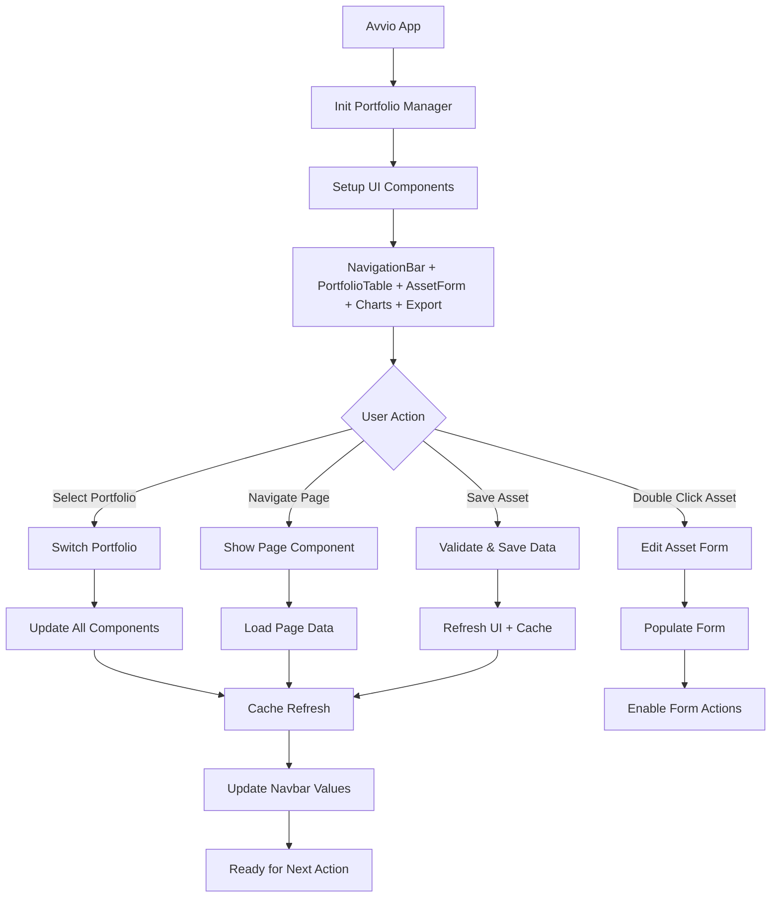

# GAB AssetMind - Portfolio Manager

Un'applicazione Python avanzata per il monitoraggio e la gestione di portafogli diversificati con interfaccia grafica moderna e funzionalità professionali.

## 📊 Caratteristiche Principali

### Tipi di Asset Supportati
- **ETF**: Fondi indicizzati/attivi quotati in borsa
- **Azioni**: Titoli azionari singoli  
- **Fondi di investimento**: Fondi comuni e gestioni patrimoniali
- **Buoni del Tesoro**: BOT, BTP, CTZ, ecc.
- **PAC**: Piani di accumulo periodici su fondi/ETF
- **Criptovalute**: Bitcoin, Ethereum, stablecoin, ecc.
- **Liquidità**: Conti correnti, conti deposito, carte prepagate
- **Immobiliare**: Proprietà fisiche e quote di società immobiliari
- **Oggetti**: Automobili, gioielli, metalli preziosi, orologi di lusso

### 🚀 Funzionalità Avanzate

#### 📈 Gestione Portfolio
- ✅ **Visualizzazione duale**: Toggle Record/Asset per vedere tutti i record storici o solo asset attuali
- ✅ **Filtri intelligenti**: Click su intestazioni colonne per filtri popup avanzati
- ✅ **Indicatori visivi**: Stelle (★) per filtri attivi, contatori dinamici
- ✅ **Tracking valore real-time**: "Valore selezionato" aggiornato in base a filtri/selezioni
- ✅ **Zoom tabella**: Controlli zoom dinamici con scrollbar intelligenti

#### 🔄 Tracciamento Storico
- ✅ **Record evolutivi**: Mantiene storico completo di ogni asset
- ✅ **Creazione record storici**: Pulsante "Nuovo Record" per aggiornamenti temporali
- ✅ **Gestione intelligente**: Solo record più recenti nel calcolo valore corrente
- ✅ **Vista completa**: Possibilità di visualizzare tutta la storia degli asset

#### 🎯 Campi Dinamici
- ✅ **Attivazione per categoria**: Campi rilevanti abilitati automaticamente
- ✅ **Valori di default**: "NA" per testo, "0" per numeri in campi non applicabili  
- ✅ **Feedback visivo**: Campi attivi in bianco, disabilitati in grigio
- ✅ **Validazione intelligente**: Controlli specifici per ogni tipo di asset

#### 💼 Gestione Asset
- ✅ **CRUD completo**: Aggiunta, modifica, eliminazione asset
- ✅ **Modalità storiche**: Creazione nuovi record mantenendo storico
- ✅ **Form intelligente**: Campi dinamici basati sulla categoria selezionata
- ✅ **Calcoli automatici**: Performance, rendimenti, valori totali

#### 📊 Analytics e Reporting  
- ✅ **Grafici interattivi**: Distribuzione categorie, rischio, performance temporale
- ✅ **Export professionale**: CSV/PDF con report dettagliati
- ✅ **Metriche avanzate**: Diversi KPI di portfolio calcolati automaticamente
- ✅ **Persistenza Excel**: Database robusto con backup automatico

## 🚀 Installazione e Avvio

### Prerequisiti
- Python 3.8 o superiore
- pip (package manager Python)

### Installazione Automatica
```bash
# Clona o scarica il progetto
cd GAB_AssetMind

# Avvia l'applicazione (installerà automaticamente le dipendenze)
python run_app.py
```

### Installazione Manuale
```bash
# Installa le dipendenze
pip install -r requirements.txt

# Avvia l'applicazione REFACTORED (raccomandato)
python main_refactored.py

# Oppure la versione legacy
python main.py
```

### 🆕 Versione Refactored vs Legacy
- **`main_refactored.py`**: Architettura modulare, performance migliori, più stabile
- **`main.py`**: Versione originale, mantenuta per compatibilità durante transizione

## 📁 Struttura del Progetto

```
GAB_AssetMind/
├── main_refactored.py   # 🆕 Applicazione principale (architettura modulare)
├── config.py           # 🆕 Configurazione centralizzata
├── utils.py            # 🆕 Utilità e validazione dati  
├── ui_components.py    # 🆕 Componenti UI base
├── asset_form.py       # 🆕 Form gestione asset avanzato
├── charts_ui.py        # 🆕 Interface grafici ottimizzata
├── export_ui.py        # 🆕 Sistema export professionale
├── models.py           # Modelli dati e gestione Excel (migliorato)
├── main.py             # Applicazione legacy (compatibilità)
├── export_utils.py     # Utilità per export PDF/CSV
├── run_app.py          # Script di avvio con controllo dipendenze
├── requirements.txt    # Dipendenze Python
├── portfolio_data.xlsx # Database Excel (creato automaticamente)
├── ARCHITECTURE.md     # 🆕 Documentazione architettura dettagliata
└── README.md           # Documentazione principale
```

## 💾 Gestione Dati

L'applicazione utilizza un file Excel (`portfolio_data.xlsx`) come database. Il file viene creato automaticamente alla prima esecuzione con i seguenti campi:

| Campo | Descrizione |
|-------|-------------|
| Id | Identificativo univoco |
| category | Categoria asset (ETF, Azioni, etc.) |
| assetName | Nome dell'asset |
| position | Posizione/quantità |
| riskLevel | Livello di rischio (1-5) |
| ticker | Simbolo di borsa |
| isin | Codice ISIN |
| createdAt | Data di creazione |
| createdAmount | Quantità iniziale |
| createdUnitPrice | Prezzo unitario iniziale |
| createdTotalValue | Valore totale iniziale |
| updatedAt | Data ultimo aggiornamento |
| updatedAmount | Quantità attuale |
| updatedUnitPrice | Prezzo unitario attuale |
| updatedTotalValue | Valore totale attuale |
| accumulationPlan | Piano di accumulo |
| accumulationAmount | Importo accumulo mensile |
| incomePerYear | Reddito annuale |
| rentalIncome | Reddito immobiliare |
| note | Note personali |

## 🎨 Interfaccia Utente

### 🎯 Layout Ottimizzato
- **Navbar compatta**: Altezza ridotta con "Valore Totale" e "Valore selezionato" sempre visibili
- **Spazi intelligenti**: Layout ottimizzato per massimizzare l'area di lavoro
- **Responsive design**: Interfaccia adattiva che si adatta alle dimensioni della finestra

### 📋 Pagine Principali

#### 1. 📊 Portfolio
- **Vista duale**: Toggle Record/Asset per visualizzare tutti i record o solo asset attuali
- **Filtri avanzati**: Click su intestazioni colonne per filtri popup con ricerca
- **Indicatori visivi**: ★ per filtri attivi, contatori "Record nn" / "Asset mm"
- **Controlli zoom**: Zoom tabella con scrollbar intelligenti
- **Tracking valore**: "Valore selezionato" con percentuale sul totale, aggiornato real-time
- **Modifica rapida**: Doppio click per modificare asset

#### 2. 📝 Asset
- **Form dinamico**: Campi abilitati/disabilitati in base alla categoria
- **4 modalità operative**:
  - 🆕 **Nuovo Asset**: Creazione asset completamente nuovo
  - ✏️ **Modifica Asset**: Modifica asset esistente (sovrascrive)  
  - 📈 **Nuovo Record**: Crea record storico per asset esistente
  - 🗑️ **Pulisci Form**: Reset completo del form
- **Validazione intelligente**: Valori "NA" o "0" per campi non applicabili
- **Feedback visuale**: Campi attivi bianchi, disabilitati grigi

#### 3. 📈 Grafici  
- **Distribuzione valore**: Grafico a torta con percentuali monetarie per categoria
- **Analisi rischio**: Distribuzione per livelli di rischio
- **Performance temporale**: Evoluzione valore nel tempo
- **Controlli dinamici**: Selezione tipo grafico con aggiornamento istantaneo
- **Coerenza dati**: Percentuali allineate con filtri Portfolio

#### 4. 📄 Export
- **Export CSV**: Dati completi in formato tabellare
- **Report PDF**: Document professionale con grafici e analisi
- **Backup Excel**: Copia sicurezza del database

## 📈 Report PDF

Il report PDF include:
- Sommario esecutivo con metriche principali
- Distribuzione asset per categoria
- Tabella dettagliata dei principali asset
- Formattazione professionale

## 🔧 Personalizzazione

### Aggiungere Nuove Categorie
Modifica la lista `categories` in `models.py`:
```python
self.categories = [
    "ETF", "Azioni", "Obbligazioni", "Buoni del Tesoro", 
    "PAC", "Criptovalute", "Liquidità", "Immobiliare", 
    "Oggetti", "La_Tua_Nuova_Categoria"
]
```

### Modificare Temi Colori
Cambia il tema in `main.py`:
```python
ctk.set_appearance_mode("dark")  # "light" o "dark"
ctk.set_default_color_theme("green")  # "blue", "green", "dark-blue"
```

## 🛠️ Dipendenze

- **customtkinter**: Interfaccia grafica moderna
- **matplotlib**: Generazione grafici
- **pandas**: Manipolazione dati Excel
- **openpyxl**: Lettura/scrittura file Excel
- **reportlab**: Generazione report PDF
- **tkcalendar**: Widget calendario
- **Pillow**: Gestione immagini
- **numpy**: Calcoli matematici

## 📊 Metriche Calcolate

L'applicazione calcola automaticamente:
- **Performance**: `(Valore Attuale - Valore Iniziale) / Valore Iniziale * 100`
- **Rendimento**: `Reddito Totale / Valore Attuale * 100`
- **Valore Corrente**: Utilizza `updatedTotalValue` se disponibile, altrimenti `createdTotalValue`
- **Reddito Totale**: Somma di `incomePerYear` + `rentalIncome`

## 🚀 Creazione Eseguibile

Per creare un eseguibile standalone:
```bash
pip install pyinstaller
pyinstaller --onefile --windowed main.py
```

## 🐛 Troubleshooting

### Errore "Module not found"
```bash
pip install -r requirements.txt
```

### File Excel corrotto
L'applicazione ricreerà automaticamente il file `portfolio_data.xlsx` se mancante.

### Errori di visualizzazione grafici
Assicurati che matplotlib sia installato correttamente:
```bash
pip install matplotlib --upgrade
```

## 🏗️ Architettura Modulare (v2.0)

L'applicazione è stata completamente **refactorizzata** con un'architettura modulare che migliora drasticamente manutenibilità, performance e scalabilità.

### 📁 Nuova Struttura
- **`main_refactored.py`**: Applicazione principale con architettura modulare
- **`config.py`**: Configurazione centralizzata (colori, dimensioni, mappature)
- **`utils.py`**: Utilità riutilizzabili (validazione, formattazione, cache)
- **`ui_components.py`**: Componenti UI specializzati (NavigationBar, PortfolioTable)
- **`asset_form.py`**: Form gestione asset con state management avanzato
- **`charts_ui.py`**: Interface grafici con matplotlib ottimizzato
- **`export_ui.py`**: Sistema export multi-formato professionale

### 🎯 Vantaggi Architettura
- ✅ **Separazione Responsabilità**: Ogni modulo ha una funzione specifica
- ✅ **Componenti Riutilizzabili**: UI components modulari e configurabili
- ✅ **Gestione Errori Centralizzata**: ErrorHandler con messaggi specifici
- ✅ **Performance Ottimizzate**: Sistema di cache intelligente per i dati
- ✅ **Configurazione Centralizzata**: Tutti i parametri UI in un singolo file
- ✅ **Validazione Robusta**: DataValidator con regole specifiche per campo
- ✅ **State Management**: Gestione stati form e componenti professionale

### 🔄 Diagramma di Flusso



Per il diagramma dettagliato dell'architettura, vedi **[ARCHITECTURE.md](ARCHITECTURE.md)**

## 🆕 Nuove Funzionalità (Ultima Release)

### 💰 Gestione Valuta Migliorata
- ✅ **Indicatori valuta**: Simbolo € nelle etichette dei campi monetari per chiarezza
- ✅ **Salvataggio ottimizzato**: Risolto errore di conversione con valori formattati in valuta
- ✅ **Campi monetari identificati**: Created/Updated Unit Price, Total Value, Accumulation Amount, Income Per Year, Rental Income

### 📊 Tracking Valore Avanzato
- ✅ **Percentuale dinamica**: "Valore selezionato" mostra ora anche la percentuale sul valore totale
- ✅ **Aggiornamento real-time**: Calcolo percentuale dinamico basato su filtri attivi
- ✅ **Coerenza dati**: Allineamento perfetto tra filtri Portfolio e grafici Analytics

### 📈 Grafici Analytics Migliorati  
- ✅ **Distribuzione valore**: Grafico "Distribuzione per Categoria" ora calcola valori monetari invece di conteggi
- ✅ **Consistenza dati**: Uso di asset più recenti per coerenza con visualizzazione Portfolio
- ✅ **Percentuali accurate**: Eliminata discrepanza tra percentuali Portfolio (es. 58.8%) e Grafici (es. 60.0%)

### 🔧 Ottimizzazioni Tecniche
- ✅ **Asset correnti**: Grafici utilizzano `get_current_assets_only()` per coerenza
- ✅ **Calcoli unificati**: Stessa logica di valore `updated_total_value.fillna(created_total_value)` ovunque
- ✅ **Performance**: Eliminati calcoli ridondanti e migliorata velocità di aggiornamento

## 📝 Licenza

Questo progetto è rilasciato sotto licenza libera per uso personale.

---

## 🚀 Roadmap - Future Implementazioni

### 🌐 Integrazione Dati Market
- **API Prezzi**: Integrazione con provider di dati finanziari (Alpha Vantage, Yahoo Finance)
- **Aggiornamento automatico**: Refresh prezzi e valutazioni in tempo reale
- **Alert prezzi**: Notifiche per soglie di prezzo/performance
- **Tracking dividendi**: Import automatico stacchi e reinvestimenti

### 📊 Analytics Avanzati
- **Dashboard KPI**: Metriche avanzate (Sharpe ratio, drawdown, alpha/beta)
- **Analisi correlazioni**: Matrice correlazioni tra asset
- **Backtesting**: Test strategie su dati storici
- **Risk metrics**: VaR, stress testing, analisi scenari

### 🔄 Automazione
- **Import banche/broker**: Connessione diretta con principali istituti
- **Reconciliazione automatica**: Matching transazioni con estratti conto
- **Backup cloud**: Sincronizzazione automatica su Google Drive/OneDrive
- **Scheduler**: Aggiornamenti e report automatici programmati

### 📱 Esperienza Utente
- **Temi personalizzabili**: Dark/light mode, colori custom
- **Dashboard modulare**: Widget trascinabili e configurabili  
- **Multi-valuta**: Supporto portfolio in valute multiple
- **Mobile companion**: App companion per consultazione mobile

### 💹 Trading & Rebalancing
- **Suggerimenti rebalancing**: AI-powered portfolio optimization
- **Tracking ordini**: Gestione ordini pendenti e eseguiti
- **Analisi performance**: Attribution analysis per contributi performance
- **Tax optimization**: Ottimizzazione fiscale realizzi/perdite

### 🔐 Sicurezza & Compliance
- **Crittografia dati**: Encryption database e backup
- **Multi-utente**: Gestione portfolio multipli con permessi
- **Audit trail**: Log completo modifiche e accessi
- **Compliance reporting**: Report per consulenti/commercialisti

### 🌍 Espansione Mercati
- **Asset internazionali**: Supporto mercati emergenti e frontier
- **Crypto avanzato**: DeFi tracking, staking rewards, yield farming  
- **Alternative investments**: Private equity, hedge funds, REITs
- **ESG scoring**: Metriche sostenibilità e impatto ambientale

### 🤖 Intelligenza Artificiale
- **Portfolio optimizer**: ML per allocation optimization
- **Sentiment analysis**: Analisi news e sentiment di mercato
- **Pattern recognition**: Identificazione pattern tecnici
- **Chatbot assistente**: AI assistant per domande e analisi

---

**Sviluppato per la gestione professionale di portafogli diversificati** 🎯  
*In continua evoluzione per soddisfare le esigenze degli investitori moderni*